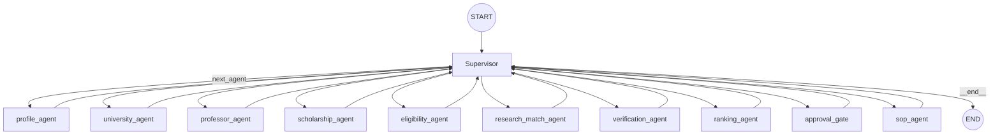

# EduPath AI — LangGraph Workflow

## Topology

`app/graph/workflow.py::build_graph()` builds a hub-and-spoke `StateGraph(EduPathState)`:

Every worker node has exactly one unconditional edge back to `supervisor`. Only `supervisor` has
conditional routing (`state["next_agent"]` decides the next hop, via `graph.add_conditional_edges`).
This means the *entire* control flow — including when to stop — is decided in one place, which is
what makes the deliberate design choices below (quota protection, deterministic re-planning,
approval-gate placement) tractable to reason about and test.

Why hub-and-spoke over a parallel fan-out: it keeps Gemini free-tier quota usage flat and
predictable (`settings.max_llm_calls_per_workflow`, a hard circuit breaker independent of Gemini's
own quota) and keeps the execution trace linear and easy to follow in the UI. A parallel design was
considered and explicitly deferred (see the root README's "Future Improvements").

## Planning

`supervisor_agent` (`app/agents/supervisor/agent.py`) only calls Gemini for a plan **once per run**
— on the first turn, when `state["execution_plan"]` is empty. Every subsequent turn reuses the
already-decided plan and just advances `plan_index`. This was the single largest source of wasted
Gemini quota before this project's current design (N steps → N supervisor planning calls, all
returning an identical plan) and is called out explicitly in the code.

If Gemini fails outright (`LLMError`), a deterministic keyword-based fallback planner
(`app/graph/routing.py::build_execution_plan`) takes over, so the workflow stays operable. If
Gemini's quota is exhausted (`LLMQuotaError`), the error is re-raised rather than falling back —
a fallback plan would just trigger every downstream agent and burn the remaining quota anyway.

`ensure_approval_gate()` (`app/graph/routing.py`) deterministically inserts `approval_gate`
immediately before `sop_agent` in the plan, whenever `sop_agent` is present — applied exactly once,
at plan-creation time. This is intentionally **not** left to the LLM: `approval_gate` isn't a
member of `ALL_AGENTS` (the LLM's selectable vocabulary), so the pause before SOP generation is a
structural guarantee, not a prompt-following outcome.

## Shared State

See [`architecture.md`](architecture.md#shared-state) for the reducer design. The state schema
(`app/graph/state.py`) includes both the original narrative fields (`profile`,
`university_research`, ...) and the structured fields added in this build:
`candidate_opportunities`, `eligibility_verdicts`, `research_match_verdicts`,
`verification_verdicts`, `ranked_opportunities`, `human_approval`.

## Human-in-the-Loop: How the Pause Actually Works

This is real pause/resume, not a cosmetic status flag — verified with LangGraph's actual
`interrupt()`/`Command(resume=...)` primitives, not simulated:

1. `approval_gate` (`app/graph/approval_gate.py`) calls `interrupt(payload)` with the ranked
   opportunities and full candidate list. LangGraph **suspends execution inside this node** and
   the enclosing `graph.invoke()` call returns immediately with a `__interrupt__` key in the
   result — the Python call stack genuinely unwinds; nothing is polling or faking a wait.
2. `WorkflowService._persist_result()` (`app/services/workflow.py`) detects `__interrupt__` in the
   result and persists `workflow_status: "awaiting_approval"` with `completed_at: None` — the
   workflow is not marked complete.
3. A **separate**, later HTTP request — `POST /workflows/{id}/approve` or `/reject` — calls
   `WorkflowService.resume()`, which invokes
   `graph.invoke(Command(resume={"decision": ..., "opportunity_id": ...}), {"configurable":
   {"thread_id": str(workflow_id)}})`. Because `thread_id` matches the original run, LangGraph's
   checkpointer resumes the *exact paused state* — `interrupt()` inside `approval_gate` returns the
   resume value, and execution continues from exactly where it left off (verified: the resumed
   `invoke()`'s result includes the *full* accumulated state from before the pause, not just the
   post-resume delta).
4. This works correctly even though a **fresh `CompiledGraph` Python object** is built for every
   HTTP request (`WorkflowService.__init__` calls `build_graph()` each time) — because the
   checkpointer itself (`app/graph/checkpoints.py::build_checkpointer`) is `@lru_cache`d and thus a
   genuine process-wide singleton, shared across every `CompiledGraph` instance regardless of which
   one happens to call `.invoke()`. This was verified directly (not assumed) during this build.
5. If the human rejects, `supervisor_agent` checks `state["human_approval"]["decision"] ==
   "reject"` on its next turn and completes the workflow immediately, skipping `sop_agent` entirely
   — it does not draft an SOP for an opportunity nobody approved.

### Known scope limit

The checkpointer is in-process memory (`MemorySaver`), not backed by Postgres/Redis — a paused
workflow can only be resumed while the *same backend process* is still running. This is a
deliberate, documented scope cut (see the root README) suitable for a local demo/single-server
deployment; a Postgres- or Redis-backed LangGraph checkpointer is the natural upgrade for
durability across restarts.

## Ranking (No LLM Call)

`ranking_agent` (`app/agents/ranking/agent.py`) is the one worker node that makes **no** Gemini
call — `app/graph/ranking.py::rank_opportunities()` is pure Python, computing a weighted score per
candidate from `eligibility_verdicts` and `research_match_verdicts` already in state. Weights are
configurable (`settings.ranking_weight_*`, sum to 1.0) rather than hardcoded, per the spec's
"make the scoring configurable" requirement. Token usage for this node is honestly reported as
unavailable (`usage_available: false`), not zero — zero would imply a measured cost, when in fact
no LLM call happened at all.

## Error Isolation

Every agent (as of this build) wraps its Gemini call in `try/except LLMError`, converting a
failure into a soft `{"errors": [...]}` state patch plus a `failed`-status `AgentResult`, so the
supervisor can continue with partial results. `LLMQuotaError` is the one exception that always
propagates — a workflow that's out of quota should stop, not silently degrade and burn the rest of
its budget on agents that will also fail.
